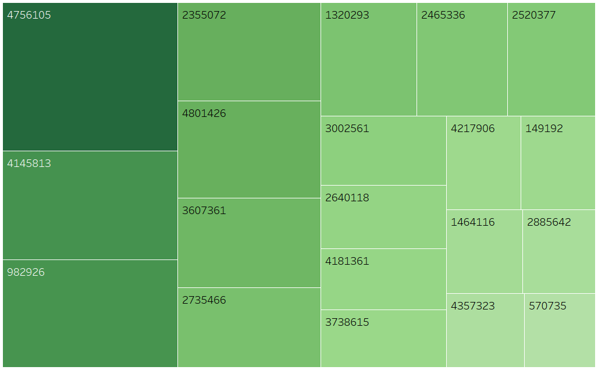

# 电商用户行为分析
## 一. 项目背景  
### 项目概览  
UserBehavior是阿里巴巴提供的一个淘宝用户行为数据集，用于隐式反馈推荐问题的研究。该数据集包含了2017年11月25日至2017年12月3日之间，有行为的约一百万随机用户的所有行为（行为包括点击、购买、加购、喜欢）  

**注：隐式反馈推荐问题**（推荐系统中用户对物品的反馈分为显式和隐式反馈，显式反馈 (如评分、评级) 或单一的隐式反馈 (如浏览、点击、加入购物车)。 隐式反馈推荐是推荐系统通过对内容和用户行为的分析,建立适当的模型,帮助用户从海量的数据中找到自己感兴趣的内容。推荐系统中用户的行为反馈包括显式反馈和隐式反馈,隐式反馈信息在推荐系统算法中被广泛应用。隐式反馈体现着用户的兴趣爱好,对隐式反馈信息的挖掘有助于提高推荐系统的效果,以更好地设计推荐系统）。

### 数据来源与理解  
数据来源：[阿里巴巴天池](https://tianchi.aliyun.com/dataset/dataDetail?dataId=649&userId=1)  
数据集介绍：  
 
  文件名称  | 说明  | 包含特征  
  ---- | ----- | ------  
  UserBehavior.csv  | 包含所有的用户行为数据 | 用户ID，商品ID，商品类目ID，行为类型，时间戳  
 
字段说明：  
 
  列名称  | 说明  
  ---- | -----  
  用户ID  | 整数类型，序列化后的用户ID  
  商品ID  | 整数类型，序列化后的商品ID  
  商品类目ID  | 整数类型，序列化后的商品所属类目ID  
  行为类型  | 字符串，枚举类型，包括('pv'--商品详情页pv，等价于点击；'buy'--商品购买；'cart'--将商品加入购物车；'fav'--收藏商品)
  时间戳  | 行为发生的时间戳  
 
## 二. 分析目的  
通过对2017年11月25日至2017年12月3日之间的用户行为数据分析，为客户提供更精准的隐式反馈推荐，提高用户忠诚度，提高商家的成交转化率。  

## 三. 分析思路  
  

## 四. 数据清洗  
#### 1. 选择子集  
源数据超过1亿，使用python截取100万数据进行分析  
```
import pandas as pd
DATA_PATH = 'C:/Users/项目/UserBehavior/UserBehavior.csv'
df = pd.read_csv(DATA_PATH, nrows=1000000)
target_name = 'C:/Users/项目/UserBehavior/UserBehavior.csv'
df.to_csv(target_name)
```  
#### 2. 列名重命名  
源数据无列名，对CSV文件进行列名重命名  
  

#### 3. 重复值处理  
```
SELECT user_id, item_id,timestamp FROM ubhsmall
GROUP BY user_id, item_id, timestamp
HAVING COUNT(user_id) > 1;-- 查询无记录
```
  
```
CREATE TABLE ubhsc
SELECT * FROM ubhsmall
GROUP BY user_id, item_id, cate_id, behavior_type, timestamp;-- 备份表
```

#### 4. 缺失值处理  
```
SELECT COUNT(user_id), COUNT(item_id), 
COUNT(cate_id), COUNT(behavior_type), COUNT(timestamp)
FROM ubhsc;
```
查询无缺失值  
  

#### 5. 一致化处理  
```
ALTER TABLE ubhsc ADD ID int unsigned primary key auto_increment;-- 新增字段ID作为主键
ALTER TABLE ubhsc ADD(longdate VARCHAR(255), date VARCHAR(255), time VARCHAR(255));-- 新增字段longdate, date, time用于存放时间

UPDATE ubhsc
SET longdate=FROM_UNIXTIME(timestamp,'%Y-%m-%d %k:%i:%s'),
date=FROM_UNIXTIME(timestamp,'%Y-%m-%d'),
time=FROM_UNIXTIME(timestamp,'%k:%i:%s')
WHERE ID BETWEEN 1 and 1000000;-- 将timestamp字段进行格式化，存放于longdate, date, time
```
```
ALTER TABLE ubhsc ADD hour INT(30);
UPDATE ubhsc SET hour = HOUR(time);-- 新增字段hour, 用于存储小时
```
  

#### 6. 异常值处理  
```
SELECT COUNT(longdate)
FROM ubhsc
WHERE longdate<'2017-11-25 00:00:00' or longdate >'2017-12-03 24:00:00';
```
  
```
DELETE FROM ubhsmallcopy
WHERE longdate<'2017-11-25 00:00:00' or longdate >'2017-12-03 24:00:00';
```
  

#### 7. 查看数据情况  
```
SELECT 
COUNT(distinct user_id) AS 用户数,
COUNT(distinct item_id) AS 商品数量,
COUNT(distinct cate_id) AS 商品类型数量,
SUM(case when behavior_type = 'pv' then 1 else 0 end) AS 浏览次数,
SUM(case when behavior_type = 'fav' then 1 else 0 end) AS 收藏次数,
SUM(case when behavior_type = 'cart' then 1 else 0 end) AS 加入购物车次数,
SUM(case when behavior_type = 'buy' then 1 else 0 end) AS 购买次数,
COUNT(longdate) AS 数据总量
from ubhsc;
```
  

## 五. 数据分析  
### （一）用户角度  
#### 1. 总体运营分析  
##### 1.1 用户流量分析
###### ①总访问量PV、总访客数UV、平均访问量PV/UV  
```
SELECT COUNT(DISTINCT user_id) AS '总访客数UV',
sum(case when behavior_type='pv' then 1 else 0 END) as '总访问量PV',
sum(case when behavior_type='pv' then 1 else 0 END)/COUNT(DISTINCT user_id) as '人均访问次数'
FROM ubhsc;
```
2017年11月25日至2017年12月3日，PV为9739，UV为876539，人均访问次数为90次  
  

###### ②PV、UV、平均访问量与日期/时间的关系  
（备注：可使用处理过后的源数据在tableau中直接进行可视化，以下SQL可提取对应数据）  
```
#以日期为维度
SELECT Date,
COUNT(DISTINCT user_ID) AS '总访客数UV',
sum(case when behavior_type='pv' then 1 else 0 END) as '总访问量PV',
sum(case when behavior_type='pv' then 1 else 0 END)/COUNT(DISTINCT user_id) as '人均访问次数'
FROM ubhsc
GROUP BY Date
ORDER BY Date;

#以（天）小时为维度（备注，以小时为维度，可计算日均UV、PV）
SELECT 'hour',
COUNT(DISTINCT User_ID) AS '总访客数UV',
sum(case when behavior_type='pv' then 1 else 0 END) as '总访问量PV',
sum(case when behavior_type='pv' then 1 else 0 END)/COUNT(DISTINCT user_id) as '人均访问次数'
FROM ubhsc
GROUP BY 'hour'
ORDER BY `hour`;
```
使用tableau连接mysql数据库，进行可视化，结果显示在2017/11/25-2017/12/3期间，PV与UV随日期的变化趋势相似，11/25-12/1保持稳定的水平，12/2开始较为明显的增长，增长率约为33%，而人均访问次数则相对平稳，自12/1有缓慢下降趋势。  
  
以一天为维度，10点-18点之间，UV、PV均无较大波动（UV在6000上下波动，PV在45000上下波动），18点-23点，UV、PV出现明显增长，PV波动明显（用户频繁访问）  
  

##### 1.2 总体销售情况  
由于数据源中未提供金额字段，此处仅分析成交量变化  
```
#成交量
SELECT sum(case when behavior_type='buy' then 1 else 0 end) as '成交量'
FROM ubhsc;
#GMV、销售金额、客单价：数据集中无金额数据，此部分暂不做分析
```
2017年11月25日至2017年12月3日，总成交量为19984  
  
```
#按日期分组，查看成交量变化趋势
SELECT date,sum(case when behavior_type='buy' then 1 else 0 end) as '成交量'
FROM ubhsc
GROUP BY date
ORDER BY date;

#以小时分组，查看成交量变化趋势
SELECT 'hour',sum(case when behavior_type='buy' then 1 else 0 end) as '成交量'
FROM ubhsc
GROUP BY 'hour'
ORDER BY 'hour';
```
从时间维度，成交量在12/2达到最大值，与PV、UV变化趋势相同  
  
成交量的变化趋势大致与UV、PV的变化趋势相同，10-16点成交量较高且趋于平稳，13点出现小高峰，而从16点开始，成交量出现下降趋势，直到18点，开始回升，20-22点为成交量最高的时间段。  
  

### (二）消费行为分析  
#### 1. 活跃用户分析  
```
# 根据日期分组，查看活跃用户
SELECT date, COUNT(DISTINCT(user_id)) AS 活跃用户
FROM ubhsc 
GROUP BY date 
ORDER BY date ASC;

# 根据小时分组，了解每个时段的活跃人数
SELECT  hour, COUNT(DISTINCT(user_id)) AS 活跃用户
FROM ubhsc 
GROUP BY hour
ORDER BY hour ASC;
```
11月25至12月1日用户活跃人数分布均匀，而12月1日开始明显出现上涨，12月2日活跃人数达到137774  
  
一天中，4点是活跃人数最低点，0-7点处于低峰，符合用户作息规律，4-10点活跃用户数回升，10-18点之间波动不大，夜间活跃人数开始增长，21点、22点用户最为活跃  
  
#### 2. 付费用户分析  
```
# 付费用户
SELECT  date, COUNT(DISTINCT(user_id)) AS 付费用户数,sum(case when behavior_type='buy' then 1 else 0 end)/COUNT(DISTINCT(user_id)) AS 付费用户人均消费次数
FROM ubhsc 
WHERE behavior_type='buy'
GROUP BY date
ORDER BY date ASC;

SELECT `hour` as 小时, COUNT(DISTINCT user_id) as 付费用户数
FROM ubhsc
WHERE behavior_type='buy'
GROUP BY `hour`;
```
付费用户数在12月2日达到最大值，而付费用户人均消费次数变化不大。  
  
一天中，付费用户数与活跃用户数变化规律一致，21点平台付费用户数最多。  
  

```
#付费率：消费人数/活跃人数
SELECT a.date, a.活跃用户数,b.付费用户数,CONCAT(ROUND(b.付费用户数*100/a.活跃用户数,2),'%') FROM 
(SELECT date, COUNT(DISTINCT(user_id)) AS 活跃用户数
FROM ubhsc 
GROUP BY date 
ORDER BY date ASC) a
LEFT JOIN 
(SELECT date, COUNT(DISTINCT user_id) as 付费用户数
FROM ubhsc
WHERE behavior_type='buy'
GROUP BY date) b ON a.date =b.date;
```
用户付费率在20%上下波动，付费率最高的日期为11月29日，而付费用户数最多的12月2日，用户付费率为18.04%。  
  

#### 3. 用户行为习惯分析  
```
SELECT user_id,COUNT(behavior_type) as '用户行为数',
sum(case when behavior_type='pv' then 1 else 0 end ) as '点击次数',
sum(case when behavior_type='fav' then 1 else 0 end) as '收藏次数',
sum(case when behavior_type='cart' then 1 else 0 end) as '加购次数',
sum(case when behavior_type='buy' then 1 else 0 end) as '购买次数'
FROM ubhsc
GROUP BY user_id
ORDER BY 用户行为数 DESC;
```
  

*（备注：tableau使用处理后原表即可，此处SQL可提取对应数据）*  
```
#按日期分组，查看不同行为的变化规律
SELECT date as '日期', 
sum(case when behavior_type='pv' then 1 else 0 end ) as '点击次数',
sum(case when behavior_type='fav' then 1 else 0 end) as '收藏次数',
sum(case when behavior_type='cart' then 1 else 0 end) as '加购次数',
sum(case when behavior_type='buy' then 1 else 0 end) as '购买次数'
FROM ubhsc
GROUP BY date
ORDER BY date ASC;
#按小时分组，查看不同行为的变化规律
SELECT `hour` as '时间', 
sum(case when behavior_type='pv' then 1 else 0 end ) as '点击次数',
sum(case when behavior_type='fav' then 1 else 0 end) as '收藏次数',
sum(case when behavior_type='cart' then 1 else 0 end) as '加购次数',
sum(case when behavior_type='buy' then 1 else 0 end) as '购买次数'
FROM ubhsc
GROUP BY `hour`
ORDER BY `hour` ASC;
```
分析显示，18点-23点，用户点击浏览行为频繁，收藏、加购、购买数量随之增加，这其中加购次数高于购买、收藏，且购买曲线与收藏曲线趋势更为接近，结合淘宝加购及收藏功能，可以分析得到，用户浏览商品后多利用加入购物车做比较，之后再选定商品进行购买。  
  

  

#### 4. 复购率与留存率  
```
#计算复购率：复购率 = 购买次数两次及其以上的人数/有购买行为的用户总数
SELECT
sum(case when t.购买次数>1 then 1 else 0 end ) as 复购次数,
sum(case when t.购买次数>0 then 1 else 0 end ) as 购买次数,
CONCAT(ROUND(sum(case when t.购买次数>1 then 1 else 0 end)*100/ sum(case when t.购买次数>0 then 1 else 0 end),2),'%') as 复购率
from 
(SELECT user_id,COUNT(behavior_type) as '用户行为数',
sum(case when behavior_type='buy' then 1 else 0 end) as '购买次数'
FROM ubhsc
GROUP BY user_id) t
```
用户复购率为65.61%  
  

```
#计算留存率：n日后留存率=(注册后的n日后还登录的用户数)/第一天新增总用户数
#以2017-11-25作为第一天，计算次日、3日、7日留存率
select count(distinct user_id) as 第一天新用户数 from ubhsc
where date = '2017-11-25';-- 6899
select count(distinct user_id) as 第二天留存用户数 from ubhsc
where date = '2017-11-26' and user_id in (SELECT user_id FROM ubhsc
WHERE date = '2017-11-25');-- 5463
select count(distinct user_id) as 第三天留存用户数 from ubhsc
where date = '2017-11-27' and user_id in (SELECT user_id FROM ubhsc
WHERE date = '2017-11-25');-- 5309
select count(distinct user_id) as 第七天留存用户数 from ubhsc
where date = '2017-12-01' and user_id in (SELECT user_id FROM ubhsc
WHERE date = '2017-11-25');-- 5334

CREATE TABLE liucun
(第一天新用户数 int,
第二天留存用户数 int,
第三天留存用户数 int,
第七天留存用户数 int)

INSERT INTO liucun VALUES(6899,5463,5309,5334);

SELECT CONCAT(ROUND(100*第二天留存用户数/第一天新用户数,2),'%')AS 次日留存率,
CONCAT(ROUND(100*第三天留存用户数/第一天新用户数,2),'%')AS 三日留存率,
CONCAT(ROUND(100*第七天留存用户数/第一天新用户数,2),'%')AS 七日留存率
from liucun;
```
用户次日留存率为79.19%、三日留存率为76.95%，七日留存率为77.32%，相差不大。  
  

### （三）用户行为转化分析  
```
#创建用户行为数据视图
#视图是指计算机数据库中的视图，是一个虚拟表，其内容由查询定义。同真实的表一样，视图包含一系列带有名称的列和行数据。但是，视图并不在数据库中以存储的数据值集形式存在。行和列数据来自由定义视图的查询所引用的表，并且在引用视图时动态生成。

#以用户数为维度
create view vuserbeha AS
select User_ID,COUNT(Behavior_type) as '用户行为数',
sum(case when Behavior_type ='pv' then 1 else 0 end ) as '点击',
sum(case when Behavior_type ='fav' then 1 else 0 end) as '收藏',
sum(case when Behavior_type ='cart' then 1 else 0 end) as '加购',
sum(case when Behavior_type ='buy' then 1 else 0 end) as '购买'
from ubhsc
GROUP BY User_ID
ORDER BY 用户行为数 DESC;

-- 用户留存分析（漏斗转化）
select sum(case when 点击>0 then 1 else 0 end)as 点击用户数,
sum(case when 收藏>0 then 1 else 0 end) as 收藏用户数,
sum(case when 加购>0 then 1 else 0 end) as 加购用户数,
sum(case when 购买>0 then 1 else 0 end) as 购买用户数
from 用户行为数据;-- 9706,3843,7297,6645

-- 点击——购买的留存分析
select 
sum(case when 购买>0 then 1 else 0 end) as 购买用户数
from 用户行为数据
where 收藏=0 and 加购=0;-- 700

-- 点击——加购——购买的留存分析
select 
sum(case when 加购>0 then 1 else 0 end) as 加购用户数,
sum(case when 购买>0 then 1 else 0 end) as 购买用户数
from 用户行为数据
where 收藏=0 and 加购<>0;-- 4608 3202

-- 点击——收藏——购买的留存分析
select 
sum(case when 收藏>0 then 1 else 0 end) as 收藏用户数,
sum(case when 购买>0 then 1 else 0 end) as 购买用户数
from 用户行为数据
where 加购=0 and 收藏<>0;-- 1154,686

-- 点击——收藏——加购——购买的留存分析
select 
sum(case when 加购>0 then 1 else 0 end) as 加购用户数,
sum(case when 收藏>0 then 1 else 0 end) as 收藏用户数,
sum(case when 购买>0 then 1 else 0 end) as 购买用户数
from 用户行为数据
where 加购<>0 and 收藏<>0;-- 2689,2689,2057
```

```
#创建用户行为数据视图
CREATE VIEW userbeha AS 
SELECT user_id, cate_id,
count(behavior_type)as 用户行为总数,
sum( CASE WHEN behavior_type = 'pv' THEN 1 ELSE 0 END ) AS 点击数,
sum( CASE WHEN behavior_type = 'fav' THEN 1 ELSE 0 END ) AS 收藏数,
sum( CASE WHEN behavior_type = 'cart' THEN 1 ELSE 0 END ) AS 加购数,
sum( CASE WHEN behavior_type = 'buy' THEN 1 ELSE 0 END ) AS 购买数 
FROM ubhsc 
GROUP BY user_id, cate_id;
```

```
#统计各行为发生总数
SELECT
  sum(用户行为总数) AS total_bh,
    sum( 点击数 ) AS total_pv,
    sum( 收藏数 ) AS total_fav,
    sum( 加购数 ) AS total_cart,
    sum( 购买数) AS total_buy
FROM
    userbeha;-- 978279,876539,27486,54270,19984
```

  

```
#计算各行为转化率
select concat(round(sum(点击数)/sum(用户行为总数)*100,2),'%') as total_to_pv, 
concat(round((sum(收藏数)+sum(加购数))/sum(点击数)*100,2),'%') as pv_to_favCart,
concat(round(sum(购买数)/sum(点击数)*100,2),'%') as pv_to_buy
from userbeha;
```

  

  

```
#比较不同路径转化率
#总点击数:876539

#点击-购买（直接购买）
SELECT SUM(购买数)FROM userbeha 
where 点击数 > 0
AND 收藏数 = 0
AND 加购数 = 0;-- 9260
-- 直接购买转化率=9260/876539=0.0105

#点击-加购-购买
SELECT SUM(加购数),SUM(购买数)FROM userbeha 
where 点击数 > 0
AND 收藏数 = 0
AND 加购数 > 0;-- 42780,5114
-- 点击-加购-购买转化率=5114/876539=0.0058

#点击-收藏-购买
SELECT SUM(收藏数),SUM(购买数)FROM userbeha 
where 点击数 > 0
AND 收藏数 > 0
AND 加购数 = 0;-- 18245,1445
-- 点击-收藏-购买转化率=1445/876539=0.0013

#点击-收藏-加购-购买
SELECT  SUM(收藏数),SUM(加购数),SUM(购买数)FROM userbeha 
where 点击数 > 0
AND 收藏数 > 0
AND 加购数 > 0;-- 4847,4310,662
-- 点击-收藏-加购-购买转化率=662/876539=0.0007
```
直接购买的转化率最高（1.05%），其次是“点击-加购-购买”  

### （四）用户价值分析（RFM模型）  
数据源未提供金额数据，从R、F角度对用户进行分群分析，此处暂不做分析  

## 二. 商品角度  
### （一）商品销售分析  
#### 1. 商品销售整体情况  
```
#曝光商品总数
select COUNT(DISTINCT Item_ID)
from ubhsc;-- 393357
```

  

```
#产生销售商品总数
select  COUNT(DISTINCT Item_ID)
from ubhsc 
where Behavior_type='buy';-- 17282
```

  

```
#用户购买商品情况
select a.购买次数,COUNT(a.Item_ID) as 商品数
FROM
(select  Item_ID,COUNT(User_ID) as 购买次数
from ubhsc 
where Behavior_type='buy'
GROUP BY Item_ID) as a
GROUP BY 购买次数
ORDER BY 购买次数 DESC;
```
在本次统计数据中，只购买一次的商品有15303种，占用户购买商品数的88.54%（15303/17282），说明商品售卖主要是依靠商品的长尾效应。  

  

#### 2. 商品排行榜  
```
#浏览top
select cate_id,
sum(case when Behavior_type ='pv' then 1 else 0 end) as '点击'
from ubhsc
GROUP BY cate_id
ORDER BY 点击 DESC
limit 20;
```
点击最高为商品4756105  
  

```
#收藏top
select cate_id,
sum(case when Behavior_type ='fav' then 1 else 0 end) as '收藏'
from ubhsc
GROUP BY cate_id
ORDER BY 收藏 DESC
limit 20;
```
收藏最高为商品4756105（与点击相同）  
  

```
#加购top
select cate_id,
sum(case when Behavior_type ='cart' then 1 else 0 end) as '加购'
from ubhsc
GROUP BY cate_id
ORDER BY 加购 DESC
limit 20;
```
加购最高为商品4756105（与点击、收藏相同）  
  

```
#购买top
select cate_id,
sum(case when Behavior_type ='buy' then 1 else 0 end) as '购买'
from ubhsc
GROUP BY cate_id
ORDER BY 购买 DESC
limit 20;
```
购买最多为商品2735466  
  

结果显示，点击、收藏、加购最多的商品是4756105，而购买最多的商品为2735466，这说明4756105的购买转化率较低，需结合实际业务分析转化率低的原因，提升购买转化率，同时优化其他商品展示，提高销量。  

 
