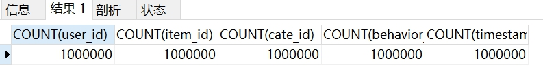

# 电商用户行为分析
## 一. 项目背景  
### 项目概览  
UserBehavior是阿里巴巴提供的一个淘宝用户行为数据集，用于隐式反馈推荐问题的研究。该数据集包含了2017年11月25日至2017年12月3日之间，有行为的约一百万随机用户的所有行为（行为包括点击、购买、加购、喜欢）  

**注：隐式反馈推荐问题**（推荐系统中用户对物品的反馈分为显式和隐式反馈，显式反馈 (如评分、评级) 或单一的隐式反馈 (如浏览、点击、加入购物车)。 隐式反馈推荐是推荐系统通过对内容和用户行为的分析,建立适当的模型,帮助用户从海量的数据中找到自己感兴趣的内容。推荐系统中用户的行为反馈包括显式反馈和隐式反馈,隐式反馈信息在推荐系统算法中被广泛应用。隐式反馈体现着用户的兴趣爱好,对隐式反馈信息的挖掘有助于提高推荐系统的效果,以更好地设计推荐系统）。

### 数据来源与理解  
数据来源：[阿里巴巴天池](https://tianchi.aliyun.com/dataset/dataDetail?dataId=649&userId=1)  
数据集介绍：  
 
  文件名称  | 说明  | 包含特征  
  ---- | ----- | ------  
  UserBehavior.csv  | 包含所有的用户行为数据 | 用户ID，商品ID，商品类目ID，行为类型，时间戳  
 
字段说明：  
 
  列名称  | 说明  
  ---- | -----  
  用户ID  | 整数类型，序列化后的用户ID  
  商品ID  | 整数类型，序列化后的商品ID  
  商品类目ID  | 整数类型，序列化后的商品所属类目ID  
  行为类型  | 字符串，枚举类型，包括('pv'--商品详情页pv，等价于点击；'buy'--商品购买；'cart'--将商品加入购物车；'fav'--收藏商品)
  时间戳  | 行为发生的时间戳  
 
## 二. 分析目的  
通过对2017年11月25日至2017年12月3日之间的用户行为数据分析，为客户提供更精准的隐式反馈推荐，提高用户忠诚度，提高商家的成交转化率。  

## 三. 分析思路  
  

## 四. 数据清洗  
### 1. 选择子集  
源数据超过1亿，使用python截取100万数据进行分析  
```
import pandas as pd
DATA_PATH = 'C:/Users/项目/UserBehavior/UserBehavior.csv'
df = pd.read_csv(DATA_PATH, nrows=1000000)
target_name = 'C:/Users/项目/UserBehavior/UserBehavior.csv'
df.to_csv(target_name)
```  
### 2. 列名重命名  
源数据无列名，对CSV文件进行列名重命名  
  

### 3. 重复值处理  
```
SELECT user_id, item_id,timestamp FROM ubhsmall
GROUP BY user_id, item_id, timestamp
HAVING COUNT(user_id) > 1;-- 查询无记录
```
  
```
CREATE TABLE ubhsc
SELECT * FROM ubhsmall
GROUP BY user_id, item_id, cate_id, behavior_type, timestamp;-- 备份表
```

### 4. 缺失值处理  
```
SELECT COUNT(user_id), COUNT(item_id), 
COUNT(cate_id), COUNT(behavior_type), COUNT(timestamp)
FROM ubhsc;
```
查询无缺失值  
  

### 5. 一致化处理  
```
ALTER TABLE ubhsc ADD ID int unsigned primary key auto_increment;-- 新增字段ID作为主键
ALTER TABLE ubhsc ADD(longdate VARCHAR(255), date VARCHAR(255), time VARCHAR(255));-- 新增字段longdate, date, time用于存放时间

UPDATE ubhsc
SET longdate=FROM_UNIXTIME(timestamp,'%Y-%m-%d %k:%i:%s'),
date=FROM_UNIXTIME(timestamp,'%Y-%m-%d'),
time=FROM_UNIXTIME(timestamp,'%k:%i:%s')
WHERE ID BETWEEN 1 and 1000000;-- 将timestamp字段进行格式化，存放于longdate, date, time
```
```
ALTER TABLE ubhsc ADD hour INT(30);
UPDATE ubhsc SET hour = HOUR(time);-- 新增字段hour, 用于存储小时
```
  

### 6. 异常值处理  
```
SELECT COUNT(longdate)
FROM ubhsc
WHERE longdate<'2017-11-25 00:00:00' or longdate >'2017-12-03 24:00:00';
```


 
